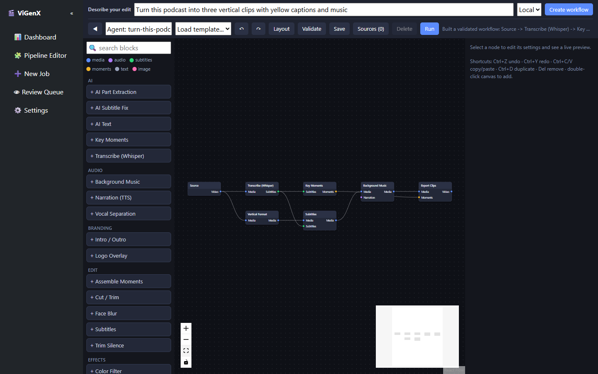

# ViGenX

**Describe an edit. Get an inspectable, editable, reproducible video workflow.**

[](https://github.com/mahdisf/vigenx/actions/workflows/ci.yml)
[](https://github.com/mahdisf/vigenx/releases)
[](LICENSE)
[](https://www.python.org/)

[Live site](https://mahdisf.github.io/vigenx/) | [Issues](https://github.com/mahdisf/vigenx/issues) | [Discussions](https://github.com/mahdisf/vigenx/discussions) | [Contributing](CONTRIBUTING.md)

ViGenX is a locally run, agent-assisted video workflow editor. Write a brief such
as:

> Turn this podcast into three vertical clips under 45 seconds with yellow
> captions, licensed background music, and a thumbnail.

ViGenX compiles the brief into a typed graph made from registered editing blocks,
validates every connection and parameter, and opens the result in the visual
editor. You can inspect, change, preview, and approve the plan before a render or
publish action occurs.

> **Project status:** pre-1.0 and suitable for development/testing. It is not a
> hosted service, a copyright-clearance system, or a fully autonomous editor.



## Why this architecture

LLMs are useful for translating intent, but they are unreliable execution
engines. ViGenX separates those responsibilities:

```text
editing brief
    |
    v
constrained planner  ----> deterministic offline fallback
    |
    v
typed PipelineGraph -----> schema + port + cycle validation
    |
    v
editable preview --------> explicit user run
    |
    v
render + sidecars --------> human rights/quality review
    |
    v
optional approved schedule
```

The planner cannot invent block types, ports, parameters, file paths, commands,
or upload targets. Generated workflows contain `requires_approval: true` and are
never executed by the planning endpoint.

## What works

| Area | Current capability |
|---|---|
| Prompt to workflow | Local deterministic planner plus optional Gemini, Groq, or NVIDIA structured planning |
| Workflow model | Serializable DAG with typed ports, cycle checks, required-input validation, and bounded parameters |
| Visual editor | React Flow canvas, generated inspector controls, templates, source selection, undo/redo, validation, frame preview, and draft render |
| Editing blocks | Trim, silence removal, moment selection, multi-clip extraction, subtitles, vertical crop, face blur, color, music, branding, intro/outro, TTS, and thumbnails |
| Execution | Background jobs, per-node progress over SSE, batch sources, atomic job persistence, and review queue |
| Provenance | Rights manifest and metadata JSON for every graph export, including every item in multi-clip export |
| Publishing boundary | Folder/YouTube/Instagram adapters, atomic scheduler claims, approved-job gate, and private visibility defaults where supported |
| Legacy paths | General, speaker, and game Python pipelines remain available while graph parity is completed |

## Quick start: prove planning first

Requirements:

- Python 3.10 or newer
- Git
- Internet access for the initial dependency install and the current editor UI

This core path does not download AI models, require an API key, or render media:

```powershell
git clone https://github.com/mahdisf/vigenx.git
cd vigenx
python scripts/bootstrap.py --profile core
.\.venv\Scripts\Activate.ps1
python -m vigenx doctor
python -m vigenx plan "Create three vertical clips with captions" --mode local --output first-workflow.json
python -m vigenx web
```

Open [http://127.0.0.1:5000/editor](http://127.0.0.1:5000/editor). Enter a brief
in **Describe your edit**, choose **Local**, and select **Create workflow**.

On macOS or Linux, activate the environment with `source .venv/bin/activate`.
For Conda, activate the environment and install `requirements-core.txt` directly
instead of creating `.venv`. Pass `--venv` to the bootstrap script when you want
a different virtual-environment path. See the complete
[getting-started guide](docs/GETTING_STARTED.md).

```powershell
conda activate vigenx
python -m pip install -r requirements-core.txt
```

`Auto` uses a configured model provider when a key is available and falls back to
the local planner if it is not. `Local` never calls a model. `AI` requires a
configured provider and fails explicitly rather than silently changing modes.

Rendering is a separate, larger setup. Install FFmpeg and `ffprobe`, then run
`python scripts/bootstrap.py --profile full` and
`python -m vigenx doctor --strict`. The strict check fails until the complete
render toolchain is available.

## Headless planning

Generate workflow JSON without opening the web app:

```powershell
python -m vigenx plan `
  "Create three vertical clips with captions and music" `
  --source ".\episode.mp4" `
  --mode local `
  --output workflow.json
```

The API exposes the same compiler:

```http
POST /api/agent/plan
Content-Type: application/json

{
  "brief": "Make one 45-second highlight reel with captions",
  "source": "episode.mp4",
  "mode": "auto"
}
```

The response includes `graph`, `summary`, `planner`, and `warnings`. Load the graph
in the editor, inspect assumptions, choose missing assets such as a logo or music
track, preview it, and run it explicitly.

## Planner behavior

The offline planner currently recognizes common intent for:

- Single reels versus multiple clips
- Target duration and clip count
- Vertical/9:16 output
- Captions and common transcript languages
- Silence removal, face blur, color treatment, music, branding, intro/outro,
  thumbnails, and semantic/key-moment selection

When highlight assembly changes the timeline, ViGenX transcribes the assembled
clip again before burning captions. This costs more compute but avoids using stale
timestamps from the source timeline.

The model-backed planner receives the brief and the generated block catalog. It
does not receive the source video during planning. Some downstream analysis
blocks, such as transcription or AI moment extraction, process media/transcript
data later when you run the approved graph.

## Configuration and keys

Defaults live in [`config/default_config.toml`](config/default_config.toml). Keep
the app bound to `127.0.0.1`; the Flask UI is a trusted local tool and has no
production multi-user authentication.

Provider keys may be set through environment variables or the local Settings
page. Stored keys are written below the gitignored `credentials/` directory.

```powershell
setx GOOGLE_API_KEY "..."
setx GROQ_API_KEY "..."
setx NVIDIA_API_KEY "..."
setx TWITCH_CLIENT_ID "..."
setx TWITCH_CLIENT_SECRET "..."
```

Never commit `.env`, OAuth tokens, cookies, model weights, downloaded media, or
anything below `credentials/`.

## Built-in graph blocks

| Category | Blocks |
|---|---|
| Source | Source |
| Edit | Cut/Trim, Trim Silence, Assemble Moments, Face Blur, Subtitles |
| Effects | Vertical Format, Color Filter |
| Audio | Background Music, Narration (TTS), Vocal Separation |
| Branding | Logo Overlay, Intro/Outro |
| AI | Whisper Transcription, Key Moments, AI Part Extraction, AI Text |
| Output | Export MP4, Export Clips, Thumbnail |

Backend block declarations are the source of truth for the palette, inspector,
planner allow-list, and graph validation. See [`engine/block.py`](engine/block.py),
[`engine/registry.py`](engine/registry.py), and [`engine/planner.py`](engine/planner.py).

## Extend ViGenX with blocks

Blocks are the public extension unit. An external Python package can register a
typed `PipelineBlock` through the `vigenx.blocks` entry-point group. Installed
blocks join the same validated catalog used by the planner, editor, and executor;
plugin import failures are isolated and reported by `python -m vigenx doctor`.

Start with the runnable [example plugin](examples/block_plugin/README.md), then
read the [block authoring contract](docs/BLOCK_AUTHORING.md). The plugin API is
experimental before 1.0, so plugin projects must pin and report the ViGenX commit
or release they test against.

## Documentation

| Goal | Read |
|---|---|
| Prove planning and open the editor | [Getting started](docs/GETTING_STARTED.md) |
| Understand trust and side-effect boundaries | [Architecture](docs/ARCHITECTURE.md) |
| Build an external editing block | [Block authoring](docs/BLOCK_AUTHORING.md) |
| Diagnose installation and runtime failures | [Troubleshooting](docs/TROUBLESHOOTING.md) |
| Submit a reproducible project example | [Showcase](docs/SHOWCASE.md) |
| Review the repository benchmark | [Editor benchmark](docs/EDITOR_BENCHMARK.md) |
| Follow released changes | [Changelog](CHANGELOG.md) |
| Report a vulnerability | [Security policy](SECURITY.md) |

## Project layout

```text
config/       application configuration and local key-store integration
core/         transcription, media, AI, metadata, and rights utilities
engine/       typed graph, constrained planner, executor, registry, and blocks
examples/     runnable prompts, workflows, and external block package
pipelines/    legacy general/speaker/game pipelines
publishing/   tracked publisher adapters and atomic scheduler
scripts/      environment bootstrap and project utilities
sources/      local/URL/social source resolution
templates/    built-in graph templates
tests/        unit, API, planner, concurrency, and persistence coverage
vigenx/       source-checkout CLI and diagnostics
web/          Flask app and no-build React Flow editor
website/      Vite landing page deployed with GitHub Pages
```

Runtime folders such as `downloads/`, `output/`, `renders/`, `jobs/`, `musics/`,
`fonts/`, and `credentials/` are intentionally ignored. Publisher source code is
under `publishing/`; generated videos remain under `output/`.

## Tests

```powershell
conda activate vigenx
python -m pytest
python -m compileall -q config core engine examples pipelines publishing scripts sources vigenx web tests
```

The unit suite does not prove codec compatibility, model quality, or render
quality on arbitrary footage. Real-video smoke fixtures and prompt-to-graph evals
remain high-priority work.

## Safety and rights

Automation does not establish fair use, ownership, platform eligibility, or
monetization rights.

- Prefer original footage, licensed stock, public-domain material, or media with
  explicit commercial permission.
- Use only licensed music, fonts, voices, logos, and images.
- Treat cropping, captions, and music as editing operations, not proof of
  transformative use.
- Review every generated rights manifest. Its checklist defaults to `false`.
- Keep upload jobs private/unlisted until quality and rights checks are complete.
- Do not expose the local Flask app to a network without implementing the controls
  listed in [`SECURITY.md`](SECURITY.md).

The Playwright publisher is intentionally non-operational and reports failure. A
browser stub must never claim that an upload occurred.

## Benchmark and roadmap

The architecture was compared with ComfyUI, n8n, FFmpeg, Remotion, LangGraph,
MoviePy, auto-editor, OpenTimelineIO, Agentic Video Editor, and Velorn. The full,
dated analysis and license cautions are in
[`docs/EDITOR_BENCHMARK.md`](docs/EDITOR_BENCHMARK.md).

## Current contribution priorities

1. Licensed tiny-video fixtures and prompt-to-graph structural evals
2. Bounded render verification and revision with explicit approval
3. Persistent content-addressed node caching
4. Workflow diff, dry-run resource estimates, and full run-from-node
5. OpenTimelineIO export and a timeline model distinct from the processing DAG
6. Subgraphs, plugin compatibility versioning, and block scaffolding

The current editor loads React, React Flow, and other UI libraries from public
CDNs. Planning and media processing run locally, but the editor is not yet fully
offline. The full render stack also lacks a licensed cross-platform smoke fixture.
These are active contribution targets, not completed capabilities.

## Contributing

Contributions are requested, especially in the roadmap areas above. Read
[`CONTRIBUTING.md`](CONTRIBUTING.md), use the issue templates, and open a design
discussion before a large architecture change.

Merged contributors are credited in release notes. Reproducible community
workflows and outputs can be submitted to the [showcase](docs/SHOWCASE.md) with
their author and source license recorded.

Apache-2.0 licensed. See [`LICENSE`](LICENSE) and [`NOTICE`](NOTICE).
